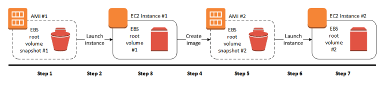
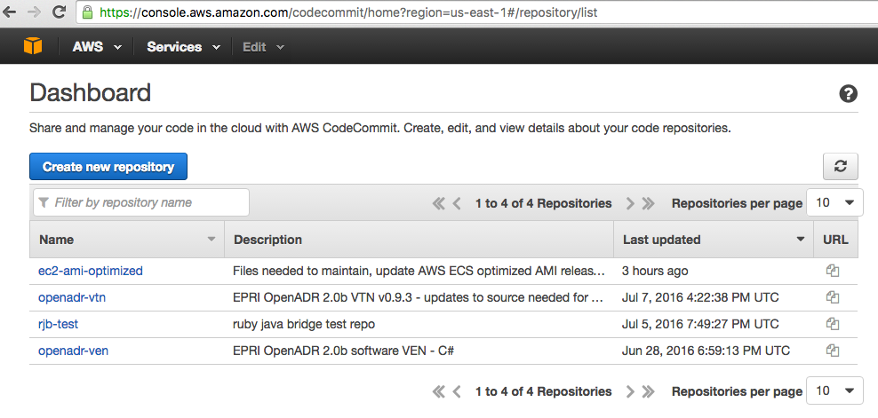
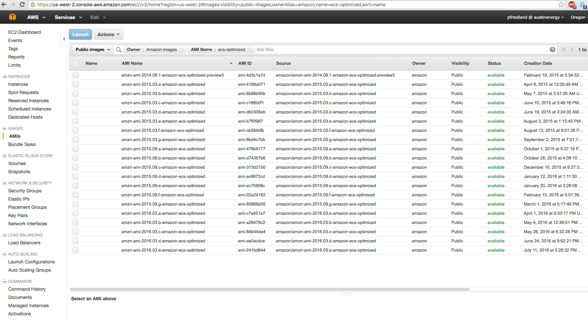
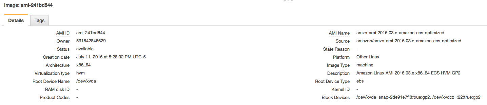

# Create a Customized AWS ECS-Optimized Linux AMI

October 28, 2015 Peter Friedland

## Objective
Periodically create a new 'Golden EC2 AMI' which is subsequently specified in EC2 Launch Configuration(s) across all EC2 instances.

## Assumptions

You will already have:
- AWS Management Console access via your AWS IAM User
- AWS CLI installed and configured
- A bash shell or 'Git shell' under Windows 7
- SSH access to AWS Code Commit (Git)

## Procedure
AWS releases Linux AMI's approximately two times per year, and sometimes more often. In particular, new updated releases of ECS-optimized AMI's are released a bit more often.  Especially if new issues are fixed or features added.

We will be following the procedure that is outlined in the AWS documentation here:

>  http://docs.aws.amazon.com/AWSEC2/latest/UserGuide/creating-an-ami-ebs.html

You will begin with the latest AWS EC2 Linux AMI.  You can read about Amazon Linux AMI here:

> https://aws.amazon.com/amazon-linux-ami/

In particular, we are interested in the most recent EC2 Linux AMI that has been optimized for use with ECS *(Elastic Container Service a.k.a Docker)*. AWS staff performs optimizations and fixes to enhance performance and proper operation such as
  - Linux LVM *(Logical Volume Manager)* used by the Docker daemon
  - Upstream updates to the Docker daemon

You can read about ECS-Optimized Linux AMI here:

> https://aws.amazon.com/marketplace/pp/B00U6QTYI2/

You can read about ECS in the AWS Developer Forum here:

> https://forums.aws.amazon.com/forum.jspa?forumID=187

This forum is updated often so you need to visit and learn!

### Preliminary  Steps
The scripts needed for this procedure are kept in an AWS Code Commit (Git) repository named **ec2-ami-optimized**.
#### Clone Code Commit (Git) Repository

> Go to the AWS Console -> Code Commit -> Dashboard

Pull the Code Commit repo down to a local directory on your workstation using 'Git Shell'.  I like to use ~/projects/git/ as my root directory and clone repositories under this directory.  Navigate to your chosen top-level repository directory and type:

> ``$ git clone ssh://git-codecommit.us-east-1.amazonaws.com/v1/repos/ec2-ami-optimized``

> ``$ cd ec2-ami-optimized``

If you have previously cloned this repository and wish to ensure you have the latest upstream changes in the remote repository, move to the directory containing the repository and type:

>  ``$ git pull``

#### Synchronize with S3 Bucket
Next, synchronize the files in this directory with a specific AWS S3 bucket/directory **s3://development-oadr/config/ecs-optimized/**.  The contents of this s3 bucket are used by the AMI during initial creation.

To achieve synchronization, you will use the AWS CLI (command line interface), again from your 'Git Shell' or simply the shell.

First do a dry run of the aws s3 sync command to see what, if anything, needs to be pushed to s3 from your local directory.  The s3 sync command is documented here:

>http://docs.aws.amazon.com/cli/latest/reference/s3/sync.html

Note we do not want to push the .git/ directory to s3.  Only the directory files need to be pushed *excluding* the .git/ sub-directory

>``$ aws s3 sync --dryrun  . s3://development-oadr/config/ecs-optimized/ --exclude="*.git/*" --exclude=".gitignore"``

If the --dryrun seems ok with no extraneous directories or files, then re-submit this command without the --dryrun argument.  It is possible that no files will need to be synchronized with the s3 bucket.

> ``$ aws s3 sync . s3://development-oadr/config/ecs-optimized/ --exclude="*.git/*" --exclude=".gitignore"``

#### Step One:  Identifying the latest AWS ECS-Optimized AMI #1

It is a manual effort to correctly identify the latest ECS-optimized AMI to be used to start this process.  Usually major annoucements and critical bug fixes in the ECS Developer Forum will coincide with an AWS ECS-Optimized AMI release.

> Go to AWS Console -> EC2 -> AMIs

Filter the list to include only:

> **Public Images**

> **Owner: Amazon**

> **AMI Name: ecs-optimized**

Scroll down the list to locate the AMI with the most recent Creation Date.  In this case, the AMI is:

> Creation Date:  **July 11, 2016**

> AMI Name: **amzn-ami-2016.03.e-amazon-ecs-optimized**

**IMPORTANT:**  Make certain you are starting from an AMI whose **Owner** is **amazon**

#### Step Two: Create EC2 Instance #1 with User Data

Once you have identified AMI #1, launch a new EC2 instance using AMI #1:

- From the EC2->AMIs display, select the AMI and **click "Launch"**:

- Choose Instance Type -> **t2.micro**

- Configure Instance Details paying particular attention to:
  - Number of Instances = **1**
  -  Network = **us-west-2 development**
  - IAM Role = **developer-role **
  - Advanced Details -> **User Data**
  - Select File Option -> Choose file **setup-ecs-image.sh** from your repo directory

-  Add Storage -> *No Changes*

-  Tag Instance -> Create Tags as follows (**case-sensitive**):
  - Name = dev-ecs-test
  - environment = development

-  Configure Security Groups -> Select an **existing** security group:

  - dev-ssh
  - health-check

-  Review and Launch -> Click **Launch**

-  Select Key Pair -> **id_rsa_training** -> Click Acknowledge -> Click **Launch Instances**

- Note the **Instance-ID** of the created EC2 instance.  You will need this in the next step.

####  Step Three: Verify EC2 Instance #1 Running

- From the AWS EC2 Instances Console, verify that the image created in Step Two is running and both EC2 Health Checks haved passed.  You can read about EC2 Health Checks here:
> http://docs.aws.amazon.com/AWSEC2/latest/UserGuide/monitoring-system-instance-status-check.html

- Using SSH and the id_rsa_training private key, login to the running EC2 instance created in Step 2:

  - ``$ ssh -i ~/.ssh/id_rsa_training ec2-user@public-ip-adress``

- Verify that the logging directory is empty, or nearly so.

  - ``$ ls -l /var/log/``

- The script specified in the instance User Data is executed only first boot.  Subsequent reboots of the same instances will not re-run the User Data script.

- For information on EC2 User Data and startup scripts, please see:

  -  http://docs.aws.amazon.com/AWSEC2/latest/UserGuide/user-data.html

####  Step Four: Creating Linux AMI #2 from Instance #1

- In the EC2 navigation pane, choose **Instances** and select your instance. Choose Actions, Image, and Create Image.

-  In the Create Image dialog box, specify values for the following fields, and then choose **Create Image**:

  - **Name** - A unique name for the image

  - **Description** (Optional) A description of the image, up to 255 characters
  - http://docs.aws.amazon.com/AWSEC2/latest/UserGuide/creating-an-ami-ebs.html#how-to-create-ebs-ami

#### Step Five:  Verify Creation of (Golden) AMI #2

- While AMI #2 is being created, you can choose **AMIs** in the navigation pane to view its status. Initially this will be pending. After a few minutes the status should change to available.

- (Optional) Choose **Snapshots** in the navigation pane to view the snapshot that was created for the new AMI. When you launch an instance from AMI #2, we use this snapshot to create its root device volume.

- Once the creation of the AMI #2 is verified, you can terminate EC2 instance #1 used to create AMI #2:
  - In the EC2 navigation pane, choose **Instances** and select your instance.
  - Choose Actions, Instance State, Terminate.

#### Step Six: Launch Instance #2 from the AMI #2

- From the EC2->AMIs display, select AMI #2 and **click "Launch"**:

- Choose Instance Type -> **t2.micro**

- Configure Instance Details paying particular attention to:
  - Number of Instances = **1**
  -  Network = **us-west-2 development**
  - IAM Role = **developer-role **
  - Advanced Details -> **User Data**
  - Select Text Option -> Copy/paste the contents of **user-data.sh** from your repo directory into **User Data**
    - The specifics of the pasted text are described both by comments within the text by the tables shown below.  It is ok to use the default values for initial testing

-  Add Storage -> *No Changes*

-  Tag Instance -> Create Tags as follows (**case-sensitive**):
  - Name = dev-ecs-test-instance
  - environment = development

-  Configure Security Groups -> Select an **existing** security group:

  - dev-ssh
  - health-check

-  Review and Launch -> Click **Launch**

-  Select Key Pair -> **id_rsa_training** -> Click Acknowledge -> Click **Launch Instances**

- Note the **Instance-ID** of the created EC2 instance.  You will need this in the next step.

#### Step Seven: Verify Instance #2 Running and Configured

#### AMI User Data
The following URL describes AWS EC2 User Data.  Remember User Data is usually a shell script with #!/bin/bash as the first line.

- For information on EC2 User Data and startup scripts, please see:
  -  http://docs.aws.amazon.com/AWSEC2/latest/UserGuide/user-data.html

It is important to remember for an EC2 Instance:

- User Data is evaluated just once during *initial boot*
- Re-booting will not trigger the User Data script to run again.

####  AMI Instance Tagging
-  For information on EC2 Instance Tagging, please see:
  - http://docs.aws.amazon.com/AWSEC2/latest/UserGuide/Using_Tags.html#tag-basics

The following EC2 instance tags can be defined when creating an EC2 instance or in an ASG (auto scaling group) definition

| Key                   | Value                     | Optional |Remarks
|:-----------------     |:--------------------------|:--------:|:--------------
| **ECS_CLUSTER**       | ECS Cluster Name          | Yes      | ECS Cluster name for EC2 instance to register
| **EFS_MOUNT_POINT**   | mount directory           | Yes      | used to mount EFS
| **EFS_DNS**           | EFS DNS                   | Yes      | existing AWS EFS DNS name
| **ELASTIC_IP**        | Elastic IP Allocation ID  | Yes      | EC2 Elastic IP (fixed) public IP allocation-id
| **environment**       | environment name          | No       | development, test, production - used for AWS console filtering and AWS billing reports
| **LOCAL_BINDIR**      | local bin directory       | No       | /usr/local/bin
| **Name**              | Human-like instance name  | No       | for AWS console filtering and reports
| **PRIVATE_DNS**       | Route53 public DNS        | Yes      | depends on PRIVATE_ZONEID and TTL
| **PRIVATE_ZONEID**    | Route53 ZONEID - private  | Yes      | depends on PRIVATE_DNS and TTL
| **PUBLIC_DNS**        | Route53 public DNS        | Yes      | depends on PUBLIC_ZONEID and TTL
| **PUBLIC_ZONEID**     | Route53 ZONEID - public   | Yes      | depends on PUBLIC_DNS and TTL
| **ROLE_ARN**          | IAM Role - cross account  | Yes      | optionally used for cross account Route53 hosted zone resource record permissions.  Dependent upon ROLE_SESSION_NAME
| **ROLE_SESSION_NAME** | User-specified            | Yes      | optionally used for cross account Route53 hosted zone resource record permissions.  Dependent upon ROLE_ARN
| **S3_BUCKET**         | S3 bucket/folder name     | No       | Required to retrieve configuration files
| **SWAPFILE_NAME**     | swapfile path             | Yes      | typically /tmp/swapfile
| **SWAPFILE_SIZE**     | size in MB                | Yes      | size depends on EC2 instance type
| **TTL**               | Route53 Recordset TTL     | Yes      | Used in conjunction with PUBLIC/PRIVATE_DNS/ZONEID
| **VOLUME_DEVICE**     | volume device             | Yes      | used to mount EBS volume
| **VOLUME_ID**         | EBS volume ID             | Yes      | EBS volume must be in same AZ as EC2 instance
| **VOLUME_MOUNT_POINT**| mount directory           | Yes      | used to mount EBS volume
